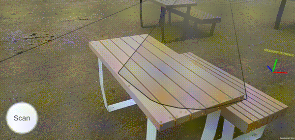

# SpacialAnalyzer

## Feature

ARFoundation tags objects with [Cloud Vision API](https://cloud.google.com/vision/docs/object-localizer)  

## Setup

1. create api key for Vision AI  
[Using API keys Authentication Google Cloud](https://cloud.google.com/docs/authentication/api-keys)  
[Vision AI](https://cloud.google.com/vision)  
  
2. set your key  
[VisionConst.cs](Assets/SpacialAnalyzer/Scripts/Vision/VisionConst.cs)

3. Build And Run, Scan Everywhere!

## Description

[ARFoundation×CloudVisionAPIで現実空間のオブジェクトにタグ付けする](https://zenn.dev/nekomimi_daimao/articles/d803fa5fa010c2)

## Dependency

### UniRx

[UniRx](https://github.com/neuecc/UniRx)

### UniTask

[UniTask](https://github.com/Cysharp/UniTask)

### VContainer

[VContainer](https://github.com/hadashiA/VContainer)

## License

[MIT](https://github.com/nekomimi-daimao/SpacialAnalyzer/blob/main/LICENSE)
